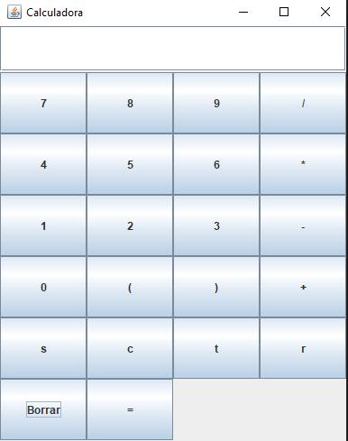

# Tarea03.
 
<br> 
 
|Integrantes del equipo                         | 
|-----------------------------------------------| 
|Brandon Urbina                     Angel Castro|

## Descripción.

Implementar una calculadora para expresiones aritmeticas sencillas como: suma, resta, multiplicacion, division, seno, coseno, tangente y raiz.

## Capturas de Pantalla.

Imagen de como se debe de ver la calcualdora con la interfaz.



## Como compilar y ejecutar.

Instrucciones paso a paso sobre cómo compilar y ejecutar la calculadora.

1.- Clona el repo con la url: https://github.com/Mod-y-programacion-2024-1-Grupo-7055/tarea-3-calculadora-bestofrendo.git
```bash
git clone https://github.com/Mod-y-programacion-2024-1-Grupo-7055/tarea-3-calculadora-bestofrendo.git
```
2.- Compila todo los .java
```bash
javac *.java
```
3.- Ejecuta el main para utilizar la calculadora.
```bash
java CalculadoraGrafica
```

### Tecnologías Utilizadas

Lenguaje de programacion: Java
Modelos de programacion utilizados: Composite, Factory Methode.

```markdown
## Tecnologías Utilizadas

- Swing (Para implementar la interfaz grafica).


